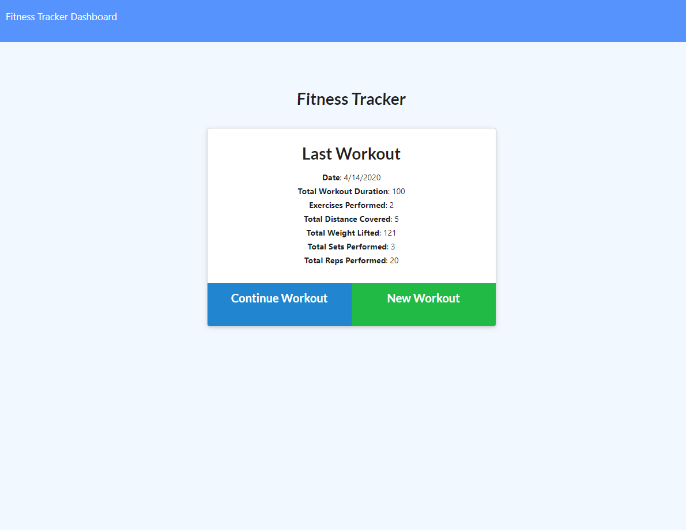
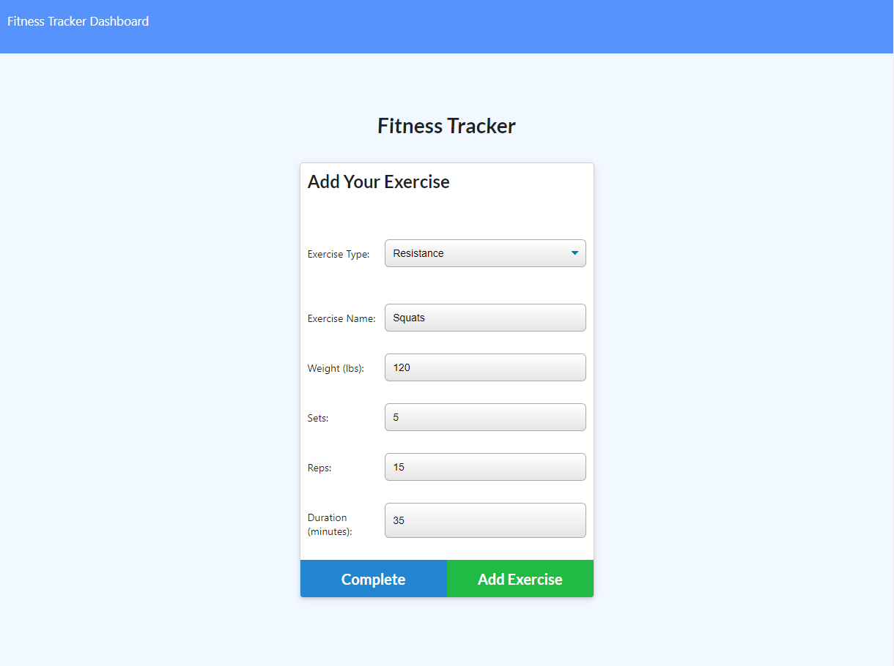
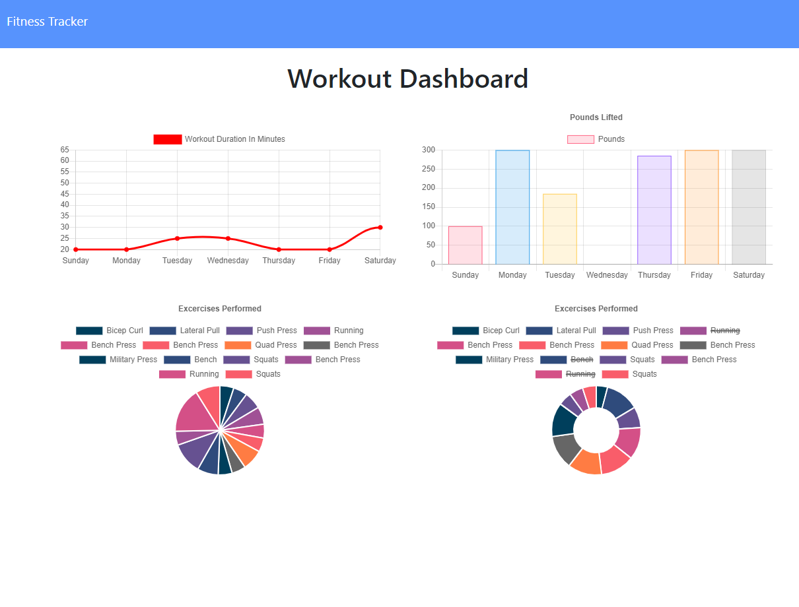

# Workout-Tracker
A workout tracker using Mongo database with a Mongoose schema and handle routes with Express.

### Table of Contents
* General Info
* Deployed Link
* Technologies

### General Info
This app lets you view, create, and track daily workouts. You can log multiple exercises in a workout on a given day and track the name, type, weight, sets, reps, duration of exercise, and distance traveled if the exercise is a cardio exercise.

### Deployed Link
[Click here to use the Workout Tracker app](https://radiant-atoll-32206.herokuapp.com/)

### Technologies
* JavaScript
* jQuery
* Node Js
* Express
* MongoDB
* Mongoose